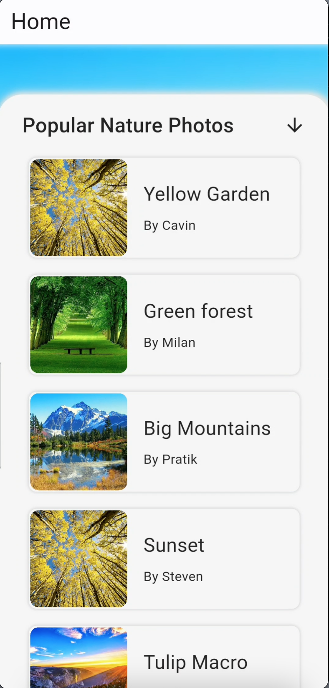

# Advanced BottomSheet UI

This repository contains the code for implementing **Advanced BottomSheet UI** in your project.

In this demo, I've implemented animated transtions using **Animated Builder**, **Stack** and **Positioned Widget**.

## Photos

## Authors
- [@cavin](https://github.com/cavin6080)

